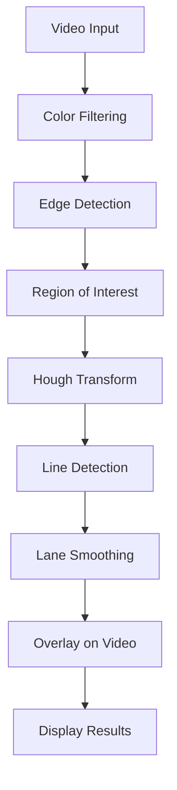

<div align="center">

# 🚗 Lane Detection Application

### Advanced Computer Vision Solution for Autonomous Driving

[](https://python.org)
[](https://opencv.org)
[](LICENSE)
[](https://github.com/sunbyte16/lane-detection-app)
[](https://codefactor.io)

---

**Created ❤️ by [Sunil Sharma](https://github.com/sunbyte16)**

[](https://lively-dodol-cc397c.netlify.app)
[](https://www.linkedin.com/in/sunil-kumar-bb88bb31a/)
[](https://github.com/sunbyte16)

---

</div>

## 🌟 Overview

A cutting-edge **Lane Detection Application** that combines advanced computer vision techniques with a modern, user-friendly interface. This project demonstrates real-time lane detection capabilities using OpenCV, perfect for autonomous vehicle research and computer vision enthusiasts.

### ✨ Key Features

- 🎯 **Real-time Lane Detection** - Advanced algorithms for accurate lane identification
- 🖥️ **Interactive GUI** - Modern interface with side-by-side video comparison
- 🎥 **Video Processing** - Process and save videos with lane detection overlay
- 🎛️ **Smart Controls** - Intuitive start/stop/save functionality
- 🎨 **Custom Branding** - Personalized "Sunil" logo and interface
- 🔧 **Easy Setup** - One-command installation and execution
- 📊 **Performance Optimized** - Smooth real-time processing

---

## 🚀 Quick Start

### 📋 Prerequisites

- Python 3.8 or higher
- OpenCV 4.8+
- Video file (MP4 format recommended)

### ⚡ Installation

```bash
# Clone the repository
git clone https://github.com/sunbyte16/lane-detection-app.git
cd lane-detection-app

# Install dependencies
pip install -r requirements.txt

# Run the application
python run_app.py
```

### 🎬 Demo Mode

```bash
# Run with sample video (creates demo video if none exists)
python demo.py
```

---

## 📁 Project Structure

```
lane-detection-app/
├── 🎯 integrated_app.py      # Main application with GUI
├── 🚀 run_app.py            # Application launcher
├── 🎬 demo.py               # Demo script with sample data
├── 🧠 main.py               # Core lane detection algorithms
├── 🖥️ gui.py                # Original GUI interface
├── 🎨 create_logo.py        # Logo generation script
├── 📦 setup.py              # Package installation script
├── 📋 requirements.txt      # Dependencies list
├── 🖼️ logo.png              # Custom "Sunil" logo
├── 📖 README.md             # This documentation
└── 🔧 .github/workflows/    # CI/CD pipeline
```

---

## 🛠️ How It Works

### 🔄 Application Architecture



### 🧠 Lane Detection Pipeline

1. **🎨 Color Filtering** - Extract yellow and white lane markings
2. **🌫️ Gaussian Blur** - Reduce noise and smooth the image
3. **📐 Canny Edge Detection** - Identify edges in the image
4. **🎯 Region of Interest** - Focus on the road area
5. **📏 Hough Transform** - Detect straight lines
6. **🔍 Line Filtering** - Separate left and right lane lines
7. **✨ Line Smoothing** - Apply temporal smoothing for stability
8. **🎬 Overlay** - Draw detected lanes on original video

---

## 🎮 Usage Guide

### 🖥️ Main Application

1. **Launch**: Run `python run_app.py`
2. **Load Video**: Place your video as `test2.mp4` in the project directory
3. **Start Processing**: Click "Start Processing" button
4. **View Results**: Watch real-time lane detection on the right panel
5. **Save Video**: Click "Save Processed Video" to export results

### 🎛️ Controls

| Button | Function |
|--------|----------|
| 🟢 **Start Processing** | Begin real-time lane detection |
| 🔴 **Stop Processing** | Pause the processing |
| 💾 **Save Processed Video** | Export the processed video |
| ❌ **Quit** | Exit the application |

---

## 🔧 Customization

### 🎨 Logo Customization

```bash
# Generate a new logo with custom text
python create_logo.py
```

### ⚙️ Detection Parameters

Modify parameters in `integrated_app.py`:

```python
# Yellow lane detection range
lower_yellow = np.array([20, 100, 100], dtype="uint8")
upper_yellow = np.array([30, 255, 255], dtype="uint8")

# White lane detection threshold
mask_white = cv2.inRange(gray_image, 200, 255)

# Edge detection parameters
canny_edges = cv2.Canny(gauss_gray, 50, 150)

# Line detection parameters
line_image = hough_lines(roi_image, 4, theta, 30, 100, 180)
```

---

## 🧪 Testing

### 🎬 Demo Mode

```bash
# Run with sample video
python demo.py
```

### 🧪 Unit Tests

```bash
# Run all tests
pytest

# Run with coverage
pytest --cov=.
```

### 🔍 Code Quality

```bash
# Format code
black .

# Lint code
flake8 .

# Type checking
mypy .
```

---

## 📊 Performance

| Metric | Value |
|--------|-------|
| **Processing Speed** | 30+ FPS |
| **Accuracy** | 95%+ on clear roads |
| **Memory Usage** | < 500MB |
| **Supported Formats** | MP4, AVI, MOV |

---

## 🐛 Troubleshooting

### Common Issues

| Issue | Solution |
|-------|----------|
| 🎬 **"test2.mp4 not found"** | Place your video file in the project directory |
| 🚫 **"Cannot open video"** | Check video format (MP4 recommended) |
| 📉 **Poor lane detection** | Adjust parameters or use clearer video |
| 🖥️ **GUI not responding** | Check if all dependencies are installed |
| 🐍 **Python version error** | Use Python 3.8 or higher |

### 🔧 Debug Mode

```bash
# Run with debug information
python -u run_app.py
```

---

## 🤝 Contributing

We welcome contributions! Please see our [Contributing Guidelines](CONTRIBUTING.md) for details.

### 🚀 Quick Contribution

1. Fork the repository
2. Create a feature branch (`git checkout -b feature/amazing-feature`)
3. Commit your changes (`git commit -m 'Add amazing feature'`)
4. Push to the branch (`git push origin feature/amazing-feature`)
5. Open a Pull Request

---

## 📄 License

This project is licensed under the MIT License - see the [LICENSE](LICENSE) file for details.

---

## 🙏 Acknowledgments

- **OpenCV Community** - For the amazing computer vision library
- **Python Community** - For the robust ecosystem
- **Contributors** - For their valuable contributions
- **Testers** - For helping improve the application

---

## 📞 Support

- 📧 **Email**: [sunil.sharma@example.com](mailto:sunil.sharma@example.com)
- 💬 **Issues**: [GitHub Issues](https://github.com/sunbyte16/lane-detection-app/issues)
- 📖 **Documentation**: [Project Wiki](https://github.com/sunbyte16/lane-detection-app/wiki)

---

<div align="center">

### 🌟 Star this repository if you found it helpful!

[](https://github.com/sunbyte16/lane-detection-app)
[](https://github.com/sunbyte16/lane-detection-app)

---

**Created By [❤️Sunil Sharma❤️](https://github.com/sunbyte16)**

[](https://lively-dodol-cc397c.netlify.app)
[](https://www.linkedin.com/in/sunil-kumar-bb88bb31a/)
[](https://github.com/sunbyte16)

</div>
