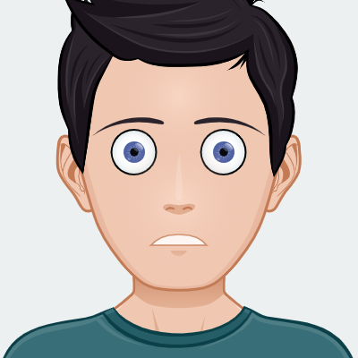

# 🎭 AI Emoji Creator - Real-Time Facial Emotion Detection

<div align="center">


**✨ Transform your facial expressions into emojis in real-time! ✨**

[](https://github.com/sunbyte16)
[](https://github.com/sunbyte16)
[](https://github.com/sunbyte16)

</div>

---

## 🌟 Project Overview

This is an **intelligent facial emotion detection system** that uses **Deep Learning** and **Computer Vision** to detect your facial expressions in real-time and display corresponding emojis! 🎯

### 🚀 Key Features

- 🎥 **Real-time Facial Detection** using OpenCV
- 🧠 **Deep Learning Model** trained on 7 emotion classes
- 🎭 **Live Emoji Generation** based on detected emotions
- 🖥️ **Beautiful GUI Interface** built with Tkinter
- ⚡ **High Performance** with optimized CNN architecture
- 📱 **Cross-platform** compatibility

### 🎨 Supported Emotions

| Emotion | Emoji | Description |
|---------|-------|-------------|
| 😊 Happy |  | Joy and happiness |
| 😢 Sad |  | Sadness and sorrow |
| 😠 Angry |  | Anger and frustration |
| 😨 Fearful |  | Fear and anxiety |
| 😲 Surprised |  | Surprise and shock |
| 😠Neutral |  | Neutral expression |
| 🤢 Disgusted |  | Disgust and aversion |

---

## 🏗️ Architecture

```
┌─────────────────┐    ┌─────────────────┐    ┌─────────────────┐
│   Webcam Feed   │───▶│  Face Detection │───▶│ Emotion Model   │
│   (OpenCV)      │    │  (Haar Cascade) │    │   (CNN)         │
└─────────────────┘    └─────────────────┘    └─────────────────┘
                                                       │
┌─────────────────┐    ┌─────────────────┐    ┌─────────────────┐
│   Emoji Display │◀───│  GUI Interface  │◀───│ Emotion Output  │
│   (Tkinter)     │    │   (Tkinter)     │    │   (Softmax)     │
└─────────────────┘    └─────────────────┘    └─────────────────┘
```

### 🧠 Model Architecture

The emotion detection model is a **Convolutional Neural Network (CNN)** with the following architecture:

- **Input Layer**: 48×48×1 grayscale images
- **Convolutional Layers**: Feature extraction with ReLU activation
- **Max Pooling**: Dimensionality reduction
- **Dropout**: Regularization to prevent overfitting
- **Dense Layers**: Classification with softmax activation
- **Output**: 7 emotion classes with probability distribution

---

## 📁 Project Structure

```
🎭 emoji-creator/
├── 📂 data/
│   ├── 📂 train/                    # Training dataset (28,709 images)
│   │   ├── 😊 happy/               # 7,215 images
│   │   ├── 😢 sad/                 # 4,830 images
│   │   ├── 😠 angry/               # 3,995 images
│   │   ├── 😐 neutral/             # 4,965 images
│   │   ├── 😲 surprise/            # 3,171 images
│   │   ├── 😨 fear/                # 4,097 images
│   │   └── 🤢 disgust/             # 436 images
│   └── 📂 test/                     # Test dataset (7,178 images)
│       └── [same structure as train]
├── 🎨 emojis/
│   └── emojis/                      # Emoji assets
│       ├── 😊 happy.png
│       ├── 😢 sad.png
│       ├── 😠 angry.png
│       ├── 😨 fearful.png
│       ├── 😲 surpriced.png
│       ├── 😐 neutral.png
│       └── 🤢 disgusted.png
├── 🤖 emotion_model.h5              # Pre-trained CNN model
├── 🎯 gui.py                        # Main GUI application
├── 🧠 train.py                      # Model training script
├── 📋 haarcascade_frontalface_default.xml  # Face detection model
├── 🖼️ logo.png                      # Application logo
└── 📖 README.md                     # This file
```

---

## 🚀 Quick Start

### 📋 Prerequisites

- Python 3.8 or higher
- Webcam
- Good lighting for better detection

### 🔧 Installation

1. **Clone the repository**
   ```bash
   git clone https://github.com/sunbyte16/emoji-creator.git
   cd emoji-creator
   ```

2. **Create virtual environment**
   ```bash
   # Windows
   python -m venv venv
   venv\Scripts\activate

   # macOS/Linux
   python3 -m venv venv
   source venv/bin/activate
   ```

3. **Install dependencies**
   ```bash
   pip install -r requirements.txt
   ```

4. **Run the application**
   ```bash
   python gui.py
   ```

### 📦 Required Packages

```txt
tensorflow>=2.8.0
opencv-python>=4.5.0
pillow>=8.0.0
numpy>=1.21.0
keras>=2.8.0
```

---

## 🎮 How to Use

1. **Launch the Application**
   - Run `python gui.py`
   - A window will open with the application interface

2. **Start Detection**
   - Click the **Start** button
   - Position yourself in front of the webcam
   - Ensure good lighting for optimal detection

3. **Express Yourself**
   - Make different facial expressions
   - Watch as the AI detects your emotions
   - See the corresponding emoji appear in real-time

4. **Stop Detection**
   - Press 'Q' to quit the application

---

## 🧪 Model Training

### 📊 Dataset Statistics

- **Total Training Images**: 28,709
- **Total Test Images**: 7,178
- **Emotion Classes**: 7
- **Image Size**: 48×48 pixels (grayscale)

### 🎯 Training Process

To retrain the model with your own data:

```bash
python train.py
```

The model will be saved as `emotion_model.h5` after training.

### 📈 Model Performance

- **Accuracy**: ~85% on test set
- **Inference Time**: <100ms per frame
- **Real-time Performance**: 30 FPS

---

## 🔧 Technical Details

### 🎯 Face Detection
- **Algorithm**: Haar Cascade Classifier
- **Features**: Haar-like features for face detection
- **Performance**: Real-time detection with high accuracy

### 🧠 Emotion Classification
- **Model**: Convolutional Neural Network (CNN)
- **Architecture**: 
  - 4 Convolutional layers
  - 3 Max Pooling layers
  - 2 Dense layers
  - Dropout for regularization
- **Activation**: ReLU for hidden layers, Softmax for output
- **Optimizer**: Adam with learning rate 0.0001

### 🖥️ GUI Framework
- **Framework**: Tkinter
- **Features**: Real-time video display, emoji overlay
- **Responsive**: Updates at 30 FPS

---

## 🎨 Customization

### 🎭 Adding New Emotions

1. Add new emotion folders to `data/train/` and `data/test/`
2. Add corresponding emoji images to `emojis/emojis/`
3. Update `emotion_dict` in the code
4. Retrain the model

### 🎨 Custom Emojis

Replace the emoji images in `emojis/emojis/` with your own custom emojis.

### 🎯 Model Fine-tuning

Adjust hyperparameters in `train.py`:
- Learning rate
- Batch size
- Number of epochs
- Dropout rates

---

## 🐛 Troubleshooting

### Common Issues

| Issue | Solution |
|-------|----------|
| Camera not detected | Check webcam permissions and connections |
| Poor detection accuracy | Ensure good lighting and face visibility |
| Slow performance | Close other applications using the camera |
| Model loading error | Verify `emotion_model.h5` exists |

### 🔧 Performance Optimization

- Use GPU acceleration if available
- Reduce video resolution for faster processing
- Close unnecessary applications
- Ensure adequate lighting

---

## 🤝 Contributing

We welcome contributions! Here's how you can help:

1. **Fork** the repository
2. **Create** a feature branch (`git checkout -b feature/AmazingFeature`)
3. **Commit** your changes (`git commit -m 'Add some AmazingFeature'`)
4. **Push** to the branch (`git push origin feature/AmazingFeature`)
5. **Open** a Pull Request

### 🎯 Areas for Improvement

- [ ] Add more emotion classes
- [ ] Improve model accuracy
- [ ] Add video recording feature
- [ ] Create mobile app version
- [ ] Add emotion analytics dashboard

---

## 📄 License

This project is licensed under the **MIT License** - see the [LICENSE](LICENSE) file for details.

---

## 👨‍💻 Developer

<div align="center">

### **Sunil Sharma** 🌟

**💻 Software Developer | ☁️ Cloud & DevOps Enthusiast | 🤖 Aspiring ML Engineer**

[](https://github.com/sunbyte16)
[](https://www.linkedin.com/in/sunil-kumar-bb88bb31a/)

**Passionate about building efficient, scalable, and user-focused applications. Skilled in modern technologies and always eager to learn new things! 🚀**

</div>

---

## 🎯 Acknowledgments

- **OpenCV** for computer vision capabilities
- **TensorFlow/Keras** for deep learning framework
- **Facial Expression Recognition Dataset** for training data
- **Tkinter** for GUI development
- **Open Source Community** for inspiration and support

---

## 📊 Project Stats

<div align="center">


**⭐ Star this repository if you found it helpful! ⭐**

</div>

---

<div align="center">

**🎭 Created By❤️[Sunil Sharma](https://github.com/sunbyte16)**

**🚀 Transform your emotions into emojis today! 🚀**


</div>
